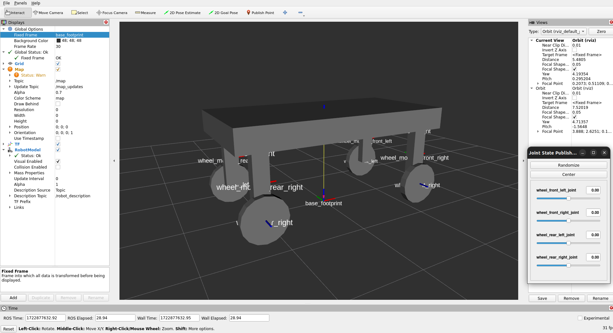
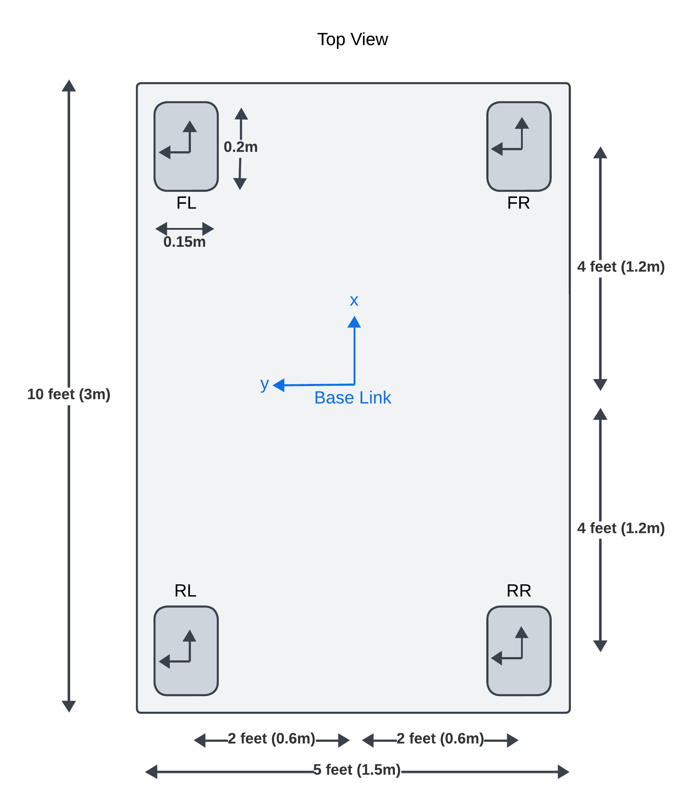
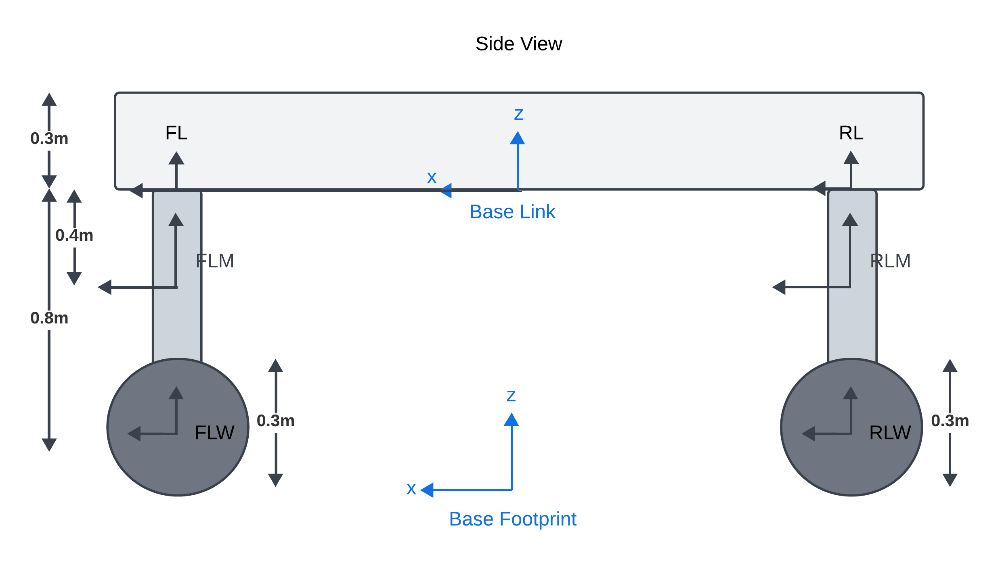
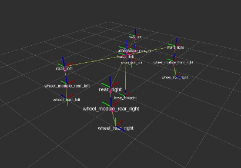

<details open markdown="block">
  <summary>
    Table of contents
  </summary>
  {: .text-delta }
1. TOC
{:toc}
</details>

# Acorn URDF Differential Drive



The first version of acorn in simulation will be a simple differential drive robot with 4
actuated wheels.

## TF2 Frames and Links





The robot will have the following frames and links:

- **base_footprint** : Parent frame for all other frames and also needed by Nav2
- **base_link** : Base center of robot chassis
- Reference Frames
  - **front_left**
  - **front_right**
  - **rear_left**
  - **rear_right**
- Wheel Module Frames
  - **wheel_module_front_left**
  - **wheel_module_front_right**
  - **wheel_module_rear_left**
  - **wheel_module_rear_right**
- Wheel Frames
  - **wheel_front_left**
  - **wheel_front_right**
  - **wheel_rear_left**
  - **wheel_rear_right**

## XACRO Macros and URDF

- Similar to the [Baseline URDF](/docs/Simulation/baseline_urdf/), we will use XACRO macros
  to define the wheel modules and wheels.
- The chassis, sensors, and GPS will be defined in the main URDF file.

### Wheel Module XACRO

```xml
<?xml version="1.0" ?>
<robot xmlns:xacro="http://www.ros.org/wiki/xacro">

    <include filename="color_macro.xacro"/>
    <include filename="inertia_macro.xacro"/>

    <!--
        A macro to create a wheel module (including links and joints)
        NOTE: A joint is just a relationship between two links (two frames)
        Parameters:
        - parent_name: Name of parent link, e.g. left_rear
        - mass: Mass of the wheel in kilogram
        - radius: Radius of the wheel in meters
        - width: Width of the wheel in meters
        - module_len: Height of wheel module in meters
        - cx, cy, cz = The position of center of wheel module w.r.t parent frame
        - side: left or right
    -->
    <xacro:macro name="wheel_assembly" params="parent_name mass radius
                              width module_len module_width_x module_width_y cx cy cz side">
        <!--
        Firstly create a link for the wheel module
        Then create a joint to connect the wheel module to the parent link
        Then create a link for wheel
        Then create a joint to connect the wheel to the wheel module
        -->
        <joint name="wheel_module_${parent_name}_joint" type="fixed">
            <parent link="${parent_name}"/>
            <child link="wheel_module_${parent_name}"/>
            <!-- This origin is where child link is placed w.r.t parent link -->
            <origin xyz="${cx} ${cy} ${cz}" rpy="0 0 0"/>
        </joint>

        <!-- Define the wheel module link -->
        <link name="wheel_module_${parent_name}">
            <visual>
                <origin xyz="0 0 0"/>
                <geometry>
                    <box size="${module_width_x} ${module_width_y} ${module_len}"/>
                </geometry>
                <material name="grey"/>
            </visual>
        </link>

        <joint name="wheel_${parent_name}_joint" type="continuous">
            <parent link="wheel_module_${parent_name}"/>
            <child link="wheel_${parent_name}"/>
            <origin xyz="0 ${wheel_position_y} ${-module_len/2.0}" rpy="${wheel_pitch} 0 0"/>
            <axis xyz="0 0 1"/>
        </joint>

        <link name="wheel_${parent_name}">
        </link>

    </xacro:macro>

</robot>
```

### Main URDF

```xml
<?xml version="1.0"?>
<robot xmlns:xacro="http://www.ros.org/wiki/xacro" name="robot">

    <!-- <xacro:include filename="robot_core.xacro" /> -->

    <!-- REFER TO IMAGES FOLDER FOR VISUAL REPRESENTATION OF THE ROBOT -->
    <xacro:include filename="wheel_module_macro.xacro" />
    <xacro:include filename="color_macro.xacro" />
    <xacro:include filename="inertia_macro.xacro" />

    <!-- CONSTANTS -->
    <xacro:property name="PI" value="3.1415926535897931"/>
    <!-- <xacro:arg name="is_simulation" default="true" /> -->

    <!-- Chassis dimensions -->
    <xacro:property name="chassis_mass" value="30.0"/> <!-- kilograms -->
    <xacro:property name="chassis_length" value="3"/> <!-- meters -->
    <xacro:property name="chassis_width" value="1.5"/>
    <xacro:property name="chassis_height" value="0.3"/>

    <!-- Wheel Module dimensions -->
    <xacro:property name="base_to_module_x" value="1.2"/> <!-- meters -->
    <xacro:property name="base_to_module_y" value="0.6"/>
    <xacro:property name="module_width_x" value="0.2"/>
    <xacro:property name="module_width_y" value="0.15"/>
    <xacro:property name="module_height" value="0.8"/>

    <!-- Wheel dimensions -->
    <xacro:property name="wheel_mass" value="1.0"/> <!-- kilograms -->
    <xacro:property name="wheel_radius" value="0.3"/> <!-- meters -->
    <xacro:property name="wheel_width" value="0.1"/>

    <!-- Define a base links for the robot. base_link and base_footprint needed for Nav2 -->
    <link name="base_footprint"/>

    <joint name="base_joint" type="fixed">
        <parent link="base_footprint"/>
        <child link="base_link"/>
        <origin xyz="0 0 ${module_height + wheel_radius}" rpy="0 0 0"/>
    </joint>

    <link name="base_link"/>

    <!-- Define a chassis link for the robot -->
    <joint name="chassis_joint" type="fixed">
        <parent link="base_link"/>
        <child link="chassis"/>
        <!-- Place the chassis at half of chassis height above the base link -->
        <origin xyz="0 0 ${chassis_height/2.0}" rpy="0 0 0"/>
    </joint>

    <link name="chassis">
    </link>

    <!-- 4 static links which will be used to connect the wheel modules to the base link -->
    <link name="front_left">
    </link>
    <link name="front_right">
    </link>
    <link name="rear_left">
    </link>
    <link name="rear_right">
    </link>

    <!-- Define the wheel modules -->
    <!-- params="parent_name mass radius width module_len module_width_x ..." -->
    <!-- NOTE: cx,cy,cz are the coordinates of the child link's center w.r.t the parent -->
    <xacro:wheel_assembly parent_name="front_left" mass="${wheel_mass}"
      radius="${wheel_radius}" width="${wheel_width}" module_len="${module_height}"
      module_width_x="${module_width_x}" module_width_y="${module_width_y}"
      cx="0" cy="0" cz="${-module_height/2.0}" side="left"/>
    <xacro:wheel_assembly parent_name="front_right" mass="${wheel_mass}"
      radius="${wheel_radius}" width="${wheel_width}" module_len="${module_height}"
      module_width_x="${module_width_x}" module_width_y="${module_width_y}"]
      cx="0" cy="0" cz="${-module_height/2.0}" side="right"/>

</robot>
```

## Robot State Publisher and Joint State Publisher

- The robot state publisher is used to publish all static (fixed) joints in URDF as TF2 frames
- Joint State Publisher is used to publish tf2 frames between non-fixed joints (wheels in this case)

### RViz Visualization



## Adding Sensors and GPS

