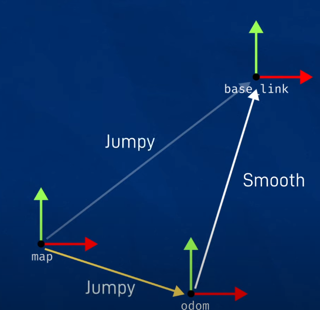

  

    Table of contents
  

  {: .text-delta }
1. TOC
{:toc}

# Nav2 with GPS

Reference: [Navigating Using GPS Localization](https://docs.nav2.org/tutorials/docs/navigation2_with_gps.html)

Every Nav2 stack for mobile robots has three frames which are needed for
navigation:

1. **Map frame**
2. **Odom frame**
3. **Base frame**

- Generally map->odom is updated by the localization system (like AMCL)
- Odom->base is updated by the robot's odometry system
- But in our case, we use GPS to update the map->odom transform

## Setup

